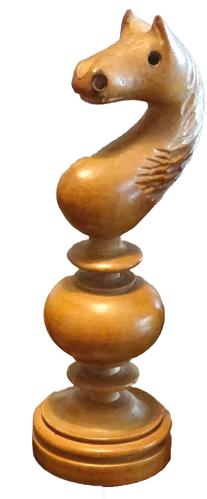

# Horsie

Chess engine written in Rust. Hopefully will be strong enough to beat me, but I'll be happy as long as it's not fucking trash

# Primmary goals:
- [ ] Move generation
- [ ] MiniMax AI
  - [ ] Alpha Beta pruning
- [ ] Multi threading
- [ ] Strong enough to beat me
- [ ] UCI

## Secondary goals
- [ ] SIMD
- [ ] Neural eval function

